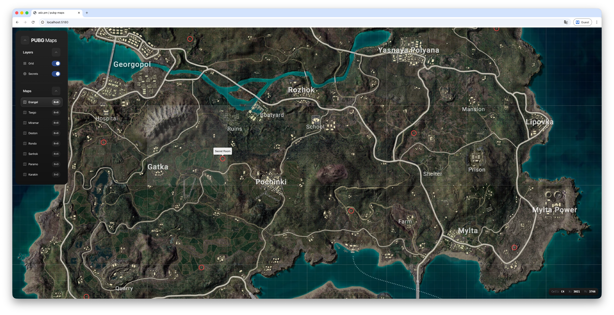

# pubg-map

## Why it exists

PUBG community resources are scattered across PNG dumps, Reddit threads, and dead wikis. The official assets are
gorgeous — until you try to actually *use* them. Open one in a browser and your tab dies; open it in an image viewer and
you lose the grid, the coordinates, and any community knowledge layered on top.

`pubg-map` treats those assets the way Mapbox treats a city: tile them, project them onto `L.CRS.Simple`, and let
Leaflet do what it does best. Then layer game data on top.

## Features

- **All Battlegrounds maps** — Erangel, Miramar, Taego, Deston, Rondo, Sanhok, Paramo, Karakin.
- **Deep-zoom tile pipeline** — source PNGs are sliced with `libvips` into Google-layout WebP pyramids (Q=92), so
  panning and zooming stays sharp from the world view down to the pixel.
- **Live grid + cell highlight** — main grid (A–H × 1–8) plus 10× sub-divisions, a hovered cell is highlighted in real
  time, and the status bar reports `cell / pixel-x / pixel-y` so screenshots and callouts have the same vocabulary.
- **Secret rooms layer** — community POI data for Erangel and Taego (more maps coming as data lands).

## Bringing your own maps

1. Drop a high-resolution PNG into `assets/maps/`. Filename = map id (lowercased): `erangel.png`, `karakin.png`, ...
2. Run `task tiles:generate`. Tiles land in `public/assets/tiles/<id>/{z}/{y}/{x}.webp` plus an `info.json` with the
   source dimensions.
3. Add an entry in [`src/data/maps.js`](src/data/maps.js) — the `cells` value defines the grid (Erangel is `8×8`, Haven
   is `1×1`, each cell maps to 1 km in-game).
4. (Optional) Add secret-room coordinates to [`src/data/secrets.js`](src/data/secrets.js). Coordinates are in
   source-image pixels — read them off the status bar while hovering in dev mode.
