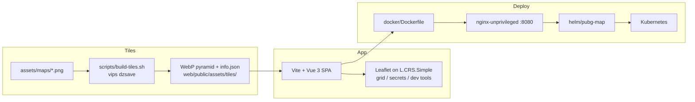

# pubg-map

Interactive PUBG battleground maps — deep-zoom tiled imagery, a live coordinate grid and secret-room markers, soon at [pubg.adz.pm](https://pubg.adz.pm).

[](https://github.com/adzpm/pubg-map/actions/workflows/ci.yml)
[](https://github.com/adzpm/pubg-map/actions/workflows/release.yml)
[](https://github.com/adzpm/pubg-map/releases)
[](LICENSE)


## Why it exists

PUBG community resources are scattered across PNG dumps, Reddit threads, and dead wikis. The official assets are
gorgeous — until you try to actually *use* them. Open one in a browser and your tab dies; open it in an image viewer and
you lose the grid, the coordinates, and any community knowledge layered on top.

`pubg-map` treats those assets the way Mapbox treats a city: tile them, project them onto `L.CRS.Simple`, and let
Leaflet do what it does best. Then layer game data on top.

## Features

- **All 9 Battlegrounds maps** — Erangel, Miramar, Vikendi, Taego, Deston, Rondo, Sanhok, Paramo, Karakin.
- **Deep-zoom tile pipeline** — source PNGs are sliced with `libvips` into Google-layout 256px WebP pyramids (Q=92), so
  panning and zooming stays sharp from the world view down to the pixel. The ~12k generated tiles are committed, so
  cloning the repo is all you need.
- **Live grid + cell highlight** — main grid (A–H × 1–8 on the big maps, scaled down to 2×2 on Karakin) plus 10×
  sub-divisions; the hovered cell is highlighted in real time and each cell maps to 1 km in-game.
- **Secret-rooms layer** — community POI data for Erangel, Taego, Deston, Rondo, Paramo and Vikendi.
- **PWA offline caching** — `vite-plugin-pwa` precaches the app shell and caches map tiles at runtime, so the maps you
  have opened keep working without a connection.
- **Smooth zoom** — a custom Leaflet handler replaces the stepped scroll-wheel zoom with a fluent, fractional one.
- **Hidden dev mode** — type `D` `E` `V` to unlock a status bar with cell/pixel coordinates and a
  copy-coordinates click tool.

## Quick start

Prerequisites: [Node.js](https://nodejs.org) >= 20.19 and [Task](https://taskfile.dev). `libvips` is only needed if you
want to regenerate tiles yourself.

```sh
git clone https://github.com/adzpm/pubg-map.git
cd pubg-map
task dev
```

The dev server starts on [http://localhost:5180](http://localhost:5180) with HMR. Without Task:

```sh
cd web
npm install
npm run dev
```

`task build` produces the production bundle in `web/dist/`, `task preview` serves it locally.

## Architecture



```
├── assets/maps/           source PNGs (not committed; see "Bringing your own maps")
├── scripts/build-tiles.sh PNG -> WebP pyramid via libvips, idempotent
├── web/                   Vue 3 + Leaflet SPA (Vite, PWA)
│   ├── public/assets/tiles/  generated tile pyramids, committed
│   ├── src/components/    map viewer, sidebar, status bar
│   ├── src/composables/   leaflet map, dev mode, dev tools, persistent refs
│   ├── src/lib/           grid, secrets, tiles, smooth zoom, dev tools
│   ├── src/data/          map registry (maps.js) and secret rooms (secrets.js)
│   └── tests/             Vitest suites mirroring src/
├── overlay/               Electron in-game overlay (Windows)
├── docker/                Dockerfile, nginx.conf, docker-compose.yml
├── helm/pubg-map/         Helm chart
└── Taskfile.yml           all entry points: task --list
```

## Bringing your own maps

1. Drop a high-resolution PNG into `assets/maps/`. Filename = map id (lowercased): `erangel.png`, `karakin.png`, ...
2. Run `task tiles:generate`. Tiles land in `web/public/assets/tiles/<id>/{z}/{y}/{x}.webp` plus an `info.json` with
   the source dimensions. Already-tiled maps are skipped; `task tiles:lint` lists PNGs that have no tiles yet.
3. Add an entry in [`web/src/data/maps.js`](web/src/data/maps.js) — the `cells` value defines the grid (Erangel is
   `8×8`, Karakin is `2×2`, each cell maps to 1 km in-game).
4. (Optional) Add secret-room coordinates to [`web/src/data/secrets.js`](web/src/data/secrets.js). Coordinates are in
   source-image pixels — the dev-mode click tool copies them in exactly the format `secrets.js` expects.

## Dev mode

Type `D` `E` `V` (within 5 seconds, outside form fields) to toggle dev mode; the flag persists across reloads. It
unlocks:

- **Status bar** — the current grid cell and source-image pixel coordinates under the cursor, so screenshots and
  callouts share the same vocabulary.
- **Copy coordinates** — click anywhere on the map to copy `{ x: ..., y: ..., name: '...' }` to the clipboard, ready to
  paste into `secrets.js`.

## Deployment

The production image is a two-stage build: `node:24.20.0-alpine` builds the bundle,
`nginxinc/nginx-unprivileged:1.31.4-alpine` serves it as uid 101 on port 8080, with the full tile tree baked in and a
`GET /healthz` endpoint answering `ok`.

### Docker

Build and run locally:

```sh
task docker:build   # docker build -f docker/Dockerfile
task docker:run     # serves on http://localhost:8080
```

With compose (binds `127.0.0.1:8083`):

```sh
task docker:up      # docker compose -f docker/docker-compose.yml up -d --build
task docker:down
```

After the first tagged release, the published image can be pulled straight from GHCR:

```sh
docker run --rm -p 8080:8080 ghcr.io/adzpm/pubg-map:0.1.0
```

### Helm

From the repo:

```sh
helm install pubg-map ./helm/pubg-map
kubectl port-forward svc/pubg-map 8080:80
```

Or from the OCI registry (available after the first tagged release):

```sh
helm install pubg-map oci://ghcr.io/adzpm/charts/pubg-map --version 0.1.0
```

The deployment is hardened by default: non-root, read-only root filesystem, dropped capabilities, seccomp
`RuntimeDefault`, probes on `/healthz`. Values worth knowing:

| Value | Default | Purpose |
| --- | --- | --- |
| `image.repository` / `image.tag` | `ghcr.io/adzpm/pubg-map` / chart `appVersion` | Image to run |
| `ingress.enabled` / `ingress.hosts` | `false` / `pubg-map.local` | Expose the site through an Ingress |
| `resources` | `10m` cpu / `32Mi`–`128Mi` memory | Sized for nginx serving static files; no cpu limit on purpose |
| `autoscaling.enabled` | `false` | HPA between 1 and 3 replicas at 80% cpu |

The full reference lives in [`helm/pubg-map/README.md`](helm/pubg-map/README.md) and
[`values.yaml`](helm/pubg-map/values.yaml); values are validated by `values.schema.json`.

## Testing & quality

```sh
task lint       # eslint (flat config, vue + prettier-compat)
task format     # prettier --write
task test       # vitest, jsdom + @vue/test-utils
```

Tests live in `web/tests/` mirroring `src/`; `npm run coverage` adds a V8 coverage report and `npm run test:watch`
keeps Vitest running. CI runs `lint`, `format:check`, `test` and `build` on Node 24, builds the Docker image, and
lints/templates the Helm chart on every pull request and push to `main`. Tagged `vX.Y.Z` releases push the multi-arch
image to `ghcr.io/adzpm/pubg-map`, push the chart to `oci://ghcr.io/adzpm/charts` and create a GitHub Release.

## In-game overlay

`overlay/` contains a frameless, always-on-top Electron overlay that projects the site over your game,
Discord-style — toggle it with the global `Alt+M` hotkey. Run it with `task electron:dev`, build the Windows
installer with `task electron:build`. Details in [`overlay/README.md`](overlay/README.md).

## Credits

Map imagery comes from the official [pubg/api-assets](https://github.com/pubg/api-assets) repository.

## License

The code is released under the [MIT License](LICENSE). Map imagery and other PUBG: Battlegrounds assets are the
property of KRAFTON, Inc., distributed via [pubg/api-assets](https://github.com/pubg/api-assets) under its own
terms — the MIT license does not cover them.
